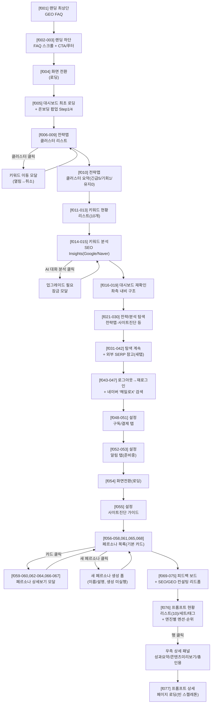
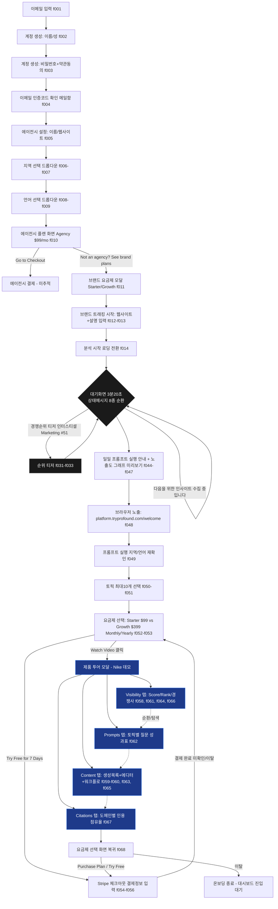
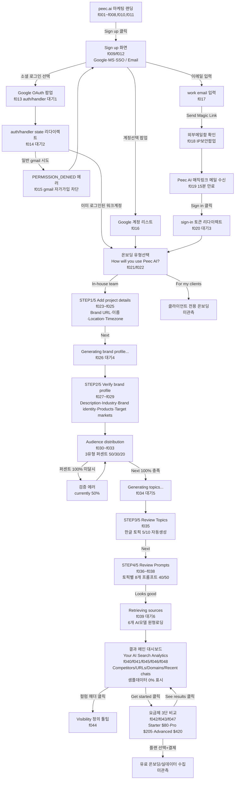
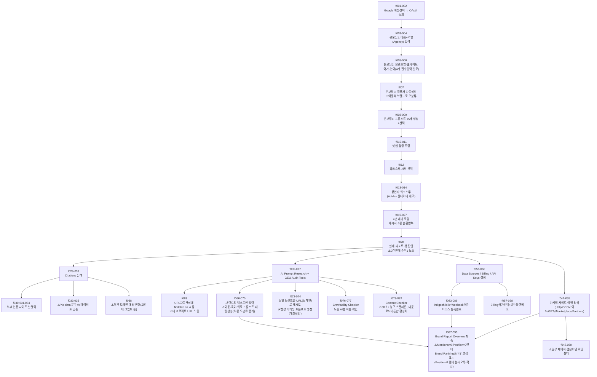

# 전체 화면 플로우 지도 — Findable + 경쟁사 5곳

실측 기준일 2026-08-21. 문서·메모리를 베끼지 않고 코드(Findable)와 화면 녹화 프레임(경쟁사 5곳)을 처음부터 끝까지 다시 확인해서 화면 단위로 재구성했다. 각 항목은 실제로 거쳐간 화면 하나이며, 빠뜨린 화면 없이 순서대로 나열했다.

**검증 이력**: 6개 제품 전부 초판 작성 후 원본(프레임 이미지 또는 코드)을 다시 열어 문서 설명을 대조 검증했다(2026-08-21). ⚠️검증 표시가 본문에 있는 곳이 실제 수정 지점이다.
- **Profound** 68개 중 3건 수정(경쟁순위 티저가 정적 반복화면·브라우저 URL바 노출 시점 1프레임 오차·탭투어 순서 뉘앙스)
- **Peec** 48개 중 6건 수정(유료벽 안내문 누락·컴포넌트 명칭 오류·프롬프트 개수 표현·results 빈화면 서술 등)
- **haloX** 21개로 재구성(f020 프레임 목록 누락 발견·설정>연동 화면 완전 누락 발견·페르소나 구간 화면개수 과장 수정)
- **Otterly** 96개 중 3건 수정(f064~f065 "렌더링 이상"이 사실과 다른 완전 오기재였음·아동오분류 인용구 부분의역·트라이얼배너 등장 시점)
- **Scrunch** 68개 중 1건 수정(f046에 강의영상·체크리스트를 잘못 귀속, 실제로는 f047)
- **Findable** 37개 중 2건 수정(요금제 4-tier→5-tier·이메일 매칭 메커니즘이 실제로는 이메일∪조직ID 합집합)

나머지 항목(각 제품 8~9할)은 실제 이미지·코드와 일치 확인됨.

## 목차

- [Findable](#findable) — 화면 37개
- [haloX](#halox) — 화면 21개(검증 후 재구성)
- [Profound](#profound) — 화면 68개
- [Peec](#peec) — 화면 48개
- [Otterly](#otterly) — 화면 96개
- [Scrunch](#scrunch) — 화면 68개


---

<a id="findable"></a>
## Findable

*근거: 코드 실측 (apps/web, apps/app 라우트) · 화면 37개*

### 화면 순서

1. [홈] (apps/web [locale]/(home)/page.tsx) — 랜딩(Hero·LiveCounter·3Pillars·단계·Showcase·FooterCTA) / 진입: 모든 신규 방문자 · 검색·광고 / 분기: CTA 클릭→/audit, 요금제 클릭→/pricing, ISR 30분 캐시(동적 API 없음)
2. [요금제] (apps/web [locale]/pricing/page.tsx) — 5-tier(Free Audit/Starter/Growth/Scale/Enterprise) 안내, FAQ / 진입: 홈·audit결과·헤더 내비 / 분기: Free Audit→/audit, Starter·Growth·Scale→app.findable.co.kr/billing(로그인 필요), Enterprise 상담→/contact / ⚠️검증: 문서 초판은 "4-tier"라 적었으나 apps/app/lib/pricing.ts 기준 Free Audit을 포함해 실제로는 5개 티어(유료만 세면 4개)
3. [진단 입력] (apps/web [locale]/audit/page.tsx + audit-form.tsx) — 이메일·도메인·언어(both/ko/en) 입력 후 POST /api/audit / 진입: 비회원 무료진단 유입 전부 / 분기: 성공→/audit/[jobId], 24h 중복(existingJobId)→같은 화면에 기존 결과 링크 노출, 429(예산/IP상한)→'문의하기' 버튼 노출→/contact, 기타 에러→인라인 에러문구
4. [진단 결과] (apps/web [locale]/audit/[jobId]/page.tsx + audit-result.tsx) — SoV·5축 GEO점수·경쟁사·출처·감성·추천액션·AI챗봇(copilot) / 진입: 진단 제출 직후 폴링, 공유링크, 북마크 재방문, 케이스/리포트 샘플링크 / 분기: status=queued/processing→ProcessingState(폴링 4s 간격, 7분 MAX_POLL_MS 넘으면 조용히 멈춤·새로고침 유도, 명시적 타임아웃 화면 없음), status=failed→FailedState('다시 시도'→/audit), !result→NoDataState, completed→CompletedView(+ViralBar: 이메일게이트/카카오공유), CTA '가입하기'→appUrl/sign-up
5. [리소스/블로그 목록] (apps/web [locale]/blog/page.tsx) — Coming Soon(BASEHUB 미설정, 발행 0건) / 진입: 헤더 내비 · SEO / 분기: '무료로 시작하기'→app.../sign-up (2026-08-19 결정: 무료진단 대신 가입 유도로 변경됨)
6. [블로그 글] (apps/web [locale]/blog/[slug]/page.tsx) — BASEHUB CMS 개별 글(현재 발행 0건) / 진입: 블로그 목록 클릭·직접 URL / 분기: 존재하지 않는 slug→서버에서 notFound() 선판정 후 404(과거엔 500 버그였음, 수정됨), 존재→본문+TOC+뒤로가기→/blog
7. [케이스 스터디: A-brand] (apps/web [locale]/case/a-brand/page.tsx) — K뷰티 5사 실측+Princeton 시뮬레이션 정적 페이지 / 진입: SEO·소셜 공유 / 분기: 브랜드별 카드 클릭→/audit/[jobId](실제 jobId, 공개), 하단 CTA→/audit
8. [산업 리포트] (apps/web [locale]/report/k-beauty-geo-2026q2/page.tsx) — 광고주 대상 K뷰티 GEO 인사이트 정적 리포트 / 진입: SEO·PR / 분기: CTA→/audit, 외부 링크→case/research
9. [오픈 데이터셋] (apps/web [locale]/research/k-geo-bench-v0_1/page.tsx) — K-GEO-Bench v0.1 학술 데이터셋 공개(CC BY 4.0) / 진입: 학계·SEO / 분기: 다운로드(정적 파일), CTA→/audit
10. [문의] (apps/web [locale]/contact/page.tsx + contact-form.tsx) — 상담/영업 문의 폼(서버 액션 제출) / 진입: 요금제 Enterprise·audit 429 에러·billing free플랜 상담 CTA / 분기: 제출 성공/실패는 같은 화면 내 인라인 처리(별도 성공 페이지 없음)
11. [약관/정책] (apps/web [locale]/legal/[slug]/page.tsx) — privacy·terms 두 슬러그만 정적 지원 / 진입: 푸터 링크 · 결제 전 고지 / 분기: 그 외 slug→notFound(), '홈으로 돌아가기'→홈
12. [결제완료(레거시)] (apps/web [locale]/checkout/success/page.tsx) — paymentId 쿼리 표시, 실제 결제 동선은 폐기됨(2026-08-03) / 진입: 과거 북마크·PG 콘솔 이력만(현재 이 화면으로의 정상 유입 경로 없음) / 분기: '앱에서 플랜 확인'→app/billing, '요금제 보기'→/pricing, '홈으로'→홈
13. [로그인] (apps/app (unauthenticated)/sign-in/[[...sign-in]]/page.tsx) — Clerk SignIn 컴포넌트 / 진입: pricing·audit결과·billing 등 app 유료 CTA, 직접 URL / 분기: 성공→(authenticated) 레이아웃이 orgId 유무로 CreateOrgGate 또는 대시보드로 분기, OAuth 선택시→/sso-callback
14. [가입] (apps/app (unauthenticated)/sign-up/[[...sign-up]]/page.tsx) — Clerk SignUp 컴포넌트 / 진입: 진단결과 CTA·blog CTA·pricing 유료 CTA / 분기: 가입 완료→CreateOrgGate(조직 0개이므로), OAuth→/sso-callback. 이메일 매칭: 별도 이전 로직 없음 — 대시보드/history/actions 등에서 매 조회 시 동적으로 이어붙임(가입 시점 마이그레이션 없음) / ⚠️검증: "primary email로만 매칭"은 부정확 — 실제 조건은 `email IN [primaryEmail, "org:{orgId}"]` **또는** `organizationId = orgId`의 합집합(history/page.tsx:23-34, 대시보드 page.tsx:54-73). 이메일 매칭은 무료진단(비회원 audit) 이력만 잡고, 조직 측정 이력은 organizationId FK로 별도로 잡힘
15. [SSO 콜백] (apps/app (unauthenticated)/sso-callback/page.tsx) — OAuth 리다이렉트 복귀 지점(@repo/auth 내부 처리) / 진입: 소셜 로그인 클릭 후 / 분기: 성공→(authenticated) 레이아웃, 실패→Clerk 자체 에러 UI(코드상 커스텀 실패 화면 없음)
16. [조직 생성 게이트] (apps/app (authenticated)/components/create-org-gate.tsx, layout.tsx에서 분기) — orgId 없는 신규 유저에게 조직 생성만 보여줌(사이드바 없음) / 진입: 가입 직후 모든 신규 유저, orgId 없이 인증된 모든 요청 / 분기: 조직 생성 완료→대시보드('/')로 복귀
17. [온보딩1: 브랜드 등록] (apps/app (authenticated)/welcome/page.tsx, welcome-intro.tsx + AssignBrandForm) — 도메인 입력→등록+자동측정 시작(기존 AssignBrandForm 재사용) / 진입: hasCompletedSetup()=false(측정 이력 0)인 조직만, org는 이미 레이아웃에서 보장됨 / 분기: hasCompletedSetup()=true(이미 측정함)→redirect('/'), 브랜드 이미 있음→온보딩2~5단계로, 폼 제출 measurement=started→/brand/measuring?job=X 또는 온보딩모드면 /welcome?measurement=started, rate_limited/failed→같은 쿼리로 다음 단계에 결말 전달(거짓 성공 방지)
18. [측정 대기(측정중)] (apps/app (authenticated)/brand/measuring/page.tsx + measuring-view.tsx) — jobId 폴링(8초 간격), 실시간 진행률 없음(정직성 원칙) / 진입: 브랜드 등록 직후 자동 리다이렉트, jobId 없거나 org 소유 아님/이미 completed면 즉시 리다이렉트 / 분기: status=completed→router.replace('/'), status=failed→'measuring failed' 뷰(브랜드는 등록됨, 재시도 안내), 4분(POLL_TIMEOUT_MS) 경과→'slow' 뷰(실패 아님, 백그라운드 계속 진행 안내), 항상 노출된 탈출구: '대시보드로 가기'→'/', 'brand 목록'→/brand(slow/failed일 때만)
19. [온보딩2: 시장 범위] (welcome-flow.tsx step=2) — 자동감지된 타깃시장(korea/global/both) 확인·수정 / 진입: 브랜드 등록 완료 후 온보딩 경로 / 분기: 다음/건너뛰기 모두→step3(값은 상태로 보존, 서버 저장은 5단계에서 일괄)
20. [온보딩3: 브랜드 별칭] (welcome-flow.tsx step=3) — 브랜드를 부르는 다른 표기(entityVariants) 자유입력 chip / 진입: 온보딩2 다음/건너뛰기 / 분기: 다음/건너뛰기→step4
21. [온보딩4: 경쟁사] (welcome-flow.tsx step=4) — AI제안 경�쟁사 chip(기본 미선택, 클릭해야 담김)+직접추가 / 진입: 온보딩3 다음/건너뛰기 / 분기: 다음/건너뛰기→step5
22. [온보딩5: 완료 확인] (welcome-flow.tsx step=5) — 요약(브랜드·시장·별칭·경쟁사) 표시, measurement 결말별로 다른 제목/설명(started/rate_limited/failed 3분기, FINISH_KEYS) / 진입: 온보딩4 완료 / 분기: '대시보드로 가기'(onSave 저장, 실패해도 무관하게 진행)→'/'
23. [대시보드] (apps/app (authenticated)/page.tsx) — KPI·SoV추세·PromptScoreboard·TruthMirror·업그레이드사다리·파트너CTA / 진입: 로그인 후 기본 랜딩, 온보딩 완료 후 / 분기: hasData=false(측정0건)→DashboardEmptyState(영업 CTA 전부 숨김, signedInEmail 전달), hasData=true→KPI+추세(SovTrendChart, 추세 없으면 emptyAction으로 StartTrackingButton)+분해+TruthMirror+미결제면 UpgradeLadder, '측정 시작'→/brand, orgId 없으면(이론상 레이아웃이 먼저 막음)→CreateOrgGate
24. [브랜드·측정] (apps/app (authenticated)/brand/page.tsx) — 브랜드 목록+상태뱃지+결과링크(새탭)+PromptWizard+BrandProfileEditor+신규등록폼(AssignBrandForm) / 진입: 사이드바·대시보드'측정시작'·프롬프트 상한도달 링크 / 분기: 등록+측정시작→/brand/measuring?job=X, 완료된 job의 '결과 보기'→새탭으로 web/audit/[jobId], 아직 측정 전 브랜드→안내문만(버튼 없음, StartTrackingButton으로 재측정 가능)
25. [추적 질문] (apps/app (authenticated)/prompts/page.tsx + prompt-wizard/list) — 브랜드별 추적 질문 목록·추가(PromptWizard)·삭제 / 진입: 사이드바 최상위 탭(경쟁사 4곳 벤치마크로 신설) / 분기: 브랜드 0개→'브랜드 등록하기'→/brand, 질문 수가 promptLimit 도달→'요금제 보기'→/billing
26. [측정 이력] (apps/app (authenticated)/history/page.tsx) — 이메일 무료진단 ∪ org측정 전체 원장, 총건수·50건 상한 고지, 진행중 자동새로고침 / 진입: 사이드바, 대시보드에서 이력 섹션 제거된 후 유일한 진입점, alerts 결제자 CTA / 분기: 없음(단일 목록 화면, 항목 클릭시 결과는 audit-history-list 내부 링크로 web/audit/[jobId])
27. [출처 링크] (apps/app (authenticated)/sources/page.tsx) — AI가 인용시 근거로 삼은 문서 출처별 분류(Growth 이상) / 진입: 사이드바 / 분기: 미결제(!isPaid)→LockedSurface(프리뷰: 예시 카드 '자사/뉴스/커뮤니티·위키 구분, 어디를 고쳐야 인용이 늘어나는지'+실제 공개 샘플진단 링크, unlockPlan=Growth→/billing), 결제자+측정없음→NeedsMeasurement(샘플링크 포함, /brand로), 결제자+측정있음→SourcesBoard
28. [경쟁사 비교] (apps/app (authenticated)/compare/page.tsx) — 우리 vs 경쟁사 언급률·순위(Growth 이상) / 진입: 사이드바 / 분기: 미결제→LockedSurface(프리뷰+샘플진단 링크, unlockPlan=Growth→/billing), 결제자+측정0건(no-run)→'측정 시작하기'→/brand(+샘플링크), 결제자+측정있으나 순위질문 없음(no-ranking)→'질문 추가하러 가기'→/brand(샘플링크 없음, 이미 측정해본 사람이라), 결제자+데이터충분→CompetitorBoard
29. [지금 할 일] (apps/app (authenticated)/actions/page.tsx) — 우선순위 액션 목록+완료체크(before/after SoV 기록)+감성분해 / 진입: 사이드바 / 분기: org Tracking 있음→ActionList(추적기준, 완료체크 가능)+SentimentSection, org Tracking 없음→같은 이메일의 최근 완료 무료진단에서 geoActions 폴백 조회(도메인 있으면 완료체크 가능, 없으면 읽기전용)→'브랜드 등록하고 추적 시작하기'→/brand, 폴백도 없음→ActionsEmptyState(영업 없이 설명만)
30. [추적 알림] (apps/app (authenticated)/alerts/page.tsx) — 자동 재측정 주기 안내(Starter 주간/Growth 매일), 변화알림 메일은 기능 자체가 미완성(환경변수 꺼짐) / 진입: 사이드바 / 분기: 미결제→LockedSurface(프리뷰: 예시 뱃지 3개, '변화 알림 메일'=준비중으로 표기, unlockPlan=Growth→/billing), 결제자→'자동 재측정이 켜져있어요' 카드(작동중 기능과 준비중 메일 명확히 분리)+'측정 이력 보기'→/history
31. [요금제·업그레이드] (apps/app (authenticated)/billing/page.tsx) — 초대코드 입력+현재플랜+4-tier 비교+결제/해지 / 진입: 사이드바, 모든 잠금화면(LockedSurface) unlockPlan 링크, 프롬프트 상한도달 링크, pricing 페이지 유료tier 링크 / 분기: 초대코드 사용(RedeemForm)→성공시 plan 즉시 갱신(같은 화면), '월 자동결제 시작'(SubscribeButton)→포트원 결제창(외부)→성공 webhook 처리 후 plan 갱신+같은 화면 반영, '1회만 결제하기'(UpgradeButton)→포트원 단건결제, 결제중 정기결제 있으면 'CancelSubscription' 해지버튼 노출(전자상거래법 요건), free플랜 상담→web/contact
32. [관리자: 진단 목록] (apps/app (authenticated)/admin/audits/page.tsx) — 전체 AuditJob 읽기전용 목록(이메일 마스킹, 50건 상한) / 진입: 사이드바 admin 그룹, isAdmin() 필수 / 분기: 비관리자→notFound()(404, 존재 자체 은폐), completed job '결과 보기'→새탭 web/audit/[jobId]
33. [관리자: 성과 근거] (apps/app (authenticated)/admin/evidence/page.tsx) — 고객사 조치 완료 전후(before/after) SoV 대조표, 인과단정 금지·caveat 항상 병기 / 진입: 사이드바 admin, isAdmin() 필수 / 분기: 비관리자→404, 조치기록 0건→빈상태 안내(actions 페이지에서 완료체크가 쌓이면 채워짐)
34. [관리자: 측정 콘솔] (apps/app (authenticated)/admin/measure/page.tsx + measure-console.tsx) — 브랜드 1건 선택 재측정(1건≈87원)+시계열 확인 / 진입: 사이드바 admin, isAdmin() 필수 / 분기: 비관리자→404, 측정 실행→서버액션 결과로 같은 화면에 측정 전후 Tracking 행수 표시(성공/실패 인라인)
35. [관리자: 운영 현황] (apps/app (authenticated)/admin/ops/page.tsx) — audit/lead/partner/원가/브랜드·Tracking 집계 대시보드(읽기전용) / 진입: 사이드바 admin, isAdmin() 필수 / 분기: 비관리자→404, stuck job(15분 초과)>0이면 경고색 표시(별도 처리 화면으로 이동 없음, 수치 확인용)
36. [관리자: 가입 조직·초대코드] (apps/app (authenticated)/admin/orgs/page.tsx + org-table.tsx) — 조직 목록+상세조회+초대코드 생성/수정+plan 일수 수동조정 / 진입: 사이드바 admin, isAdmin() 필수 / 분기: 비관리자→404, '상세보기'→같은 화면 내 확장(getOrgDetail), 코드 생성/수정/plan일수 조정→서버액션 성공시 같은 테이블 즉시 갱신
37. [관리자: 파트너 승인] (apps/app (authenticated)/admin/partners/page.tsx + partner-review-table.tsx) — 파트너 신청 검토(pending/approved/rejected 필터)+승인/거절 / 진입: 사이드바 admin, isAdmin() 필수 / 분기: 비관리자→404, '승인' 클릭→낙관적 업데이트 후 approvePartner 서버액션(성공: Growth상당 접근 부여+토스트, 실패: 롤백+에러토스트, warning 있으면 별도 경고토스트), '거절' 클릭→사유 입력 모달→rejectPartner(성공/실패 토스트, 실패시 상태 롤백)

### 플로우 다이어그램

```mermaid
flowchart TB
    %% ============ WEB (비회원 마케팅) ============
    subgraph WEB["apps/web — 마케팅 · 무료진단 (locale)"]
        HOME["홈 (home)"]
        PRICING["요금제 /pricing"]
        AUDIT_FORM["진단 입력 /audit"]
        AUDIT_RESULT["진단 결과 /audit/[jobId]"]
        BLOG_IDX["리소스 /blog (Coming Soon)"]
        BLOG_SLUG["블로그 글 /blog/[slug]"]
        CASE["케이스 스터디 /case/a-brand"]
        REPORT["산업 리포트 /report/k-beauty-geo-2026q2"]
        RESEARCH["오픈 데이터셋 /research/k-geo-bench-v0_1"]
        CONTACT["문의 /contact"]
        LEGAL["약관·정책 /legal/[slug]"]
        CHECKOUT_SUCCESS["결제완료(레거시) /checkout/success"]
        NOT_FOUND_WEB["404 (blog slug 없음/legal slug 없음)"]
    end

    %% ============ AUTH (미인증) ============
    subgraph AUTH["apps/app — 미인증"]
        SIGNIN["로그인 /sign-in"]
        SIGNUP["가입 /sign-up"]
        SSO["OAuth 콜백 /sso-callback"]
    end

    %% ============ ONBOARDING/게이트 ============
    subgraph ONB["apps/app — 조직·온보딩 게이트"]
        ORGGATE["조직 생성 게이트 CreateOrgGate"]
        WELCOME1["온보딩1 브랜드 등록 /welcome (브랜드없음)"]
        MEASURING["측정 대기 /brand/measuring"]
        WELCOME2["온보딩2 시장범위 (step2)"]
        WELCOME3["온보딩3 별칭 (step3)"]
        WELCOME4["온보딩4 경쟁사 (step4)"]
        WELCOME5["온보딩5 확인·완료 (step5)"]
    end

    %% ============ LOOP (측정·분석 루프) ============
    subgraph LOOP["apps/app — 인증 후 대시보드 루프"]
        DASH["대시보드 / (빈상태 or 데이터)"]
        BRAND["브랜드·측정 /brand"]
        PROMPTS["추적 질문 /prompts"]
        HISTORY["측정 이력 /history"]
        SOURCES["출처 링크 /sources (Growth+)"]
        COMPARE["경쟁사 비교 /compare (Growth+)"]
        ACTIONS["지금 할 일 /actions"]
        ALERTS["추적 알림 /alerts (Growth+)"]
    end

    %% ============ BILLING ============
    subgraph BILL["apps/app — 결제"]
        BILLING["요금제·업그레이드 /billing"]
        PORTONE["포트원 결제창 (외부)"]
    end

    %% ============ ADMIN ============
    subgraph ADMIN["apps/app — 관리자(admin 게이트, 아니면 404)"]
        AD_AUDITS["진단 목록 /admin/audits"]
        AD_EVIDENCE["성과 근거 /admin/evidence"]
        AD_MEASURE["측정 콘솔 /admin/measure"]
        AD_OPS["운영 현황 /admin/ops"]
        AD_ORGS["가입 조직·초대코드 /admin/orgs"]
        AD_PARTNERS["파트너 승인 /admin/partners"]
    end

    %% ============ CRON/백그라운드 ============
    subgraph CRON["백그라운드 (사용자 화면 아님)"]
        RUNNER["audit runner (엔진 7/4곳 호출)"]
        AUTOREFRESH["cron 자동 재측정 (일/주)"]
        SWEEP["cron sweep-stuck-jobs (15분 stale)"]
    end

    %% ---- WEB 내부 이동 ----
    HOME -->|CTA 무료진단| AUDIT_FORM
    HOME -->|요금제 보기| PRICING
    PRICING -->|Free Audit| AUDIT_FORM
    PRICING -->|Starter/Growth/Scale| BILLING
    PRICING -->|Enterprise 상담| CONTACT
    AUDIT_FORM -->|제출 성공| AUDIT_RESULT
    AUDIT_FORM -->|429 예산/IP 상한| CONTACT
    AUDIT_FORM -->|24h 중복| AUDIT_RESULT
    AUDIT_RESULT -->|폴링 시작| RUNNER
    RUNNER -->|완료| AUDIT_RESULT
    AUDIT_RESULT -->|failed| AUDIT_FORM
    AUDIT_RESULT -->|풀리포트 이메일 게이트| AUDIT_RESULT
    AUDIT_RESULT -->|카카오톡 공유 shared=1| AUDIT_RESULT
    AUDIT_RESULT -->|가입하고 추적하기 CTA| SIGNUP
    BLOG_IDX -->|무료로 시작하기| SIGNUP
    BLOG_IDX -.->|글 존재시| BLOG_SLUG
    BLOG_SLUG -->|없는 slug| NOT_FOUND_WEB
    BLOG_SLUG -->|목록으로| BLOG_IDX
    CASE -->|무료 진단 받기| AUDIT_FORM
    CASE -->|샘플 jobId 링크| AUDIT_RESULT
    REPORT --> AUDIT_FORM
    RESEARCH --> AUDIT_FORM
    LEGAL -->|없는 slug| NOT_FOUND_WEB
    LEGAL -->|홈으로| HOME
    CONTACT -->|폼 제출| CONTACT
    CHECKOUT_SUCCESS -->|앱에서 플랜 확인| BILLING
    CHECKOUT_SUCCESS --> PRICING
    CHECKOUT_SUCCESS --> HOME

    %% ---- WEB -> AUTH 진입 ----
    AUDIT_RESULT -.->|appUrl/sign-up| SIGNUP
    PRICING -.->|app.findable.co.kr/billing 유료 CTA| BILLING
    BLOG_IDX -.-> SIGNUP

    %% ---- AUTH 내부 ----
    SIGNIN -->|성공| DASH
    SIGNUP -->|이메일 인증/가입 완료| ORGGATE
    SIGNIN -->|OAuth| SSO
    SIGNUP -->|OAuth| SSO
    SSO -->|성공| ORGGATE

    %% ---- ORG 게이트 ----
    ORGGATE -->|조직 생성 완료| DASH
    DASH -->|orgId 없음| ORGGATE
    BRAND -->|orgId 없음| ORGGATE

    %% ---- 온보딩 분기 ----
    DASH -.->|첫 방문·측정0건| WELCOME1
    WELCOME1 -->|이미 측정 이력 있음| DASH
    WELCOME1 -->|브랜드 등록+측정시작| MEASURING
    WELCOME1 -->|브랜드 등록+측정시작 온보딩경로| WELCOME2
    MEASURING -->|job.status completed| DASH
    MEASURING -->|잘못된/없는 job| BRAND
    WELCOME2 -->|다음/건너뛰기| WELCOME3
    WELCOME3 -->|다음/건너뛰기| WELCOME4
    WELCOME4 -->|다음/건너뛰기| WELCOME5
    WELCOME5 -->|완료(저장 성공/실패 무관)| DASH

    %% ---- 측정 결말 3분기(온보딩 경로) ----
    WELCOME1 -->|started| WELCOME2
    WELCOME1 -->|rate_limited| WELCOME2
    WELCOME1 -->|failed| WELCOME2

    %% ---- LOOP 내부 ----
    DASH -->|측정 시작| BRAND
    DASH -->|측정 이력 더보기| HISTORY
    BRAND -->|등록+측정| MEASURING
    BRAND -->|질문 마법사| PROMPTS
    PROMPTS -->|상한 도달| BILLING
    PROMPTS -->|브랜드 없음| BRAND
    ACTIONS -->|무료진단만 있고 org측정 없음| ACTIONS
    ACTIONS -->|브랜드 등록하고 추적시작| BRAND
    SOURCES -->|미결제 잠금 프리뷰| BILLING
    SOURCES -->|측정 없음 empty| BRAND
    COMPARE -->|미결제 잠금 프리뷰| BILLING
    COMPARE -->|측정 없음(no-run)| BRAND
    COMPARE -->|순위질문 없음(no-ranking)| BRAND
    ALERTS -->|미결제 잠금 프리뷰| BILLING
    ALERTS -->|결제자, 이력보기| HISTORY
    HISTORY -->|진행중 자동새로고침| HISTORY
    DASH -->|업그레이드 사다리| BILLING
    DASH -->|파트너 CTA| BILLING

    %% ---- BILLING ----
    BILLING -->|초대코드 사용| BILLING
    BILLING -->|월 자동결제 시작| PORTONE
    BILLING -->|1회만 결제| PORTONE
    PORTONE -->|성공 webhook| BILLING
    PORTONE -->|성공(구 리다이렉트)| CHECKOUT_SUCCESS
    PORTONE -->|실패/취소| BILLING
    BILLING -->|free플랜 상담| CONTACT
    BILLING -->|해지| BILLING

    %% ---- ADMIN ----
    AD_AUDITS -->|isAdmin 아님| NOT_FOUND_WEB
    AD_EVIDENCE -->|isAdmin 아님| NOT_FOUND_WEB
    AD_MEASURE -->|isAdmin 아님| NOT_FOUND_WEB
    AD_OPS -->|isAdmin 아님| NOT_FOUND_WEB
    AD_ORGS -->|isAdmin 아님| NOT_FOUND_WEB
    AD_PARTNERS -->|isAdmin 아님| NOT_FOUND_WEB
    AD_AUDITS -->|결과보기 새탭| AUDIT_RESULT
    AD_MEASURE -->|1건 재측정 실행| RUNNER
    AD_ORGS -->|초대코드 생성/plan일수 조정| AD_ORGS
    AD_PARTNERS -->|승인| AD_PARTNERS
    AD_PARTNERS -->|거절+사유| AD_PARTNERS
    AD_EVIDENCE -->|재측정 누적| AD_EVIDENCE

    %% ---- CRON ----
    AUTOREFRESH -->|주기 재측정| RUNNER
    SWEEP -->|15분 초과 stuck job| AD_OPS
    RUNNER -->|완료| HISTORY
    RUNNER -->|완료| DASH

```

---

<a id="halox"></a>
## haloX

*근거: 화면녹화 77프레임 판독 (docs/_경쟁사_UIUX/haloX) · 화면 22개*

### 화면 순서

1. [랜딩 페이지 최상단] (f001) — GEO 관련 FAQ('GEO가 뭔가요') 노출, 서비스 소개 / 스크롤 진입점
2. [랜딩 페이지 하단 FAQ] (f002~f003) — FAQ #07까지 스크롤, '30초 무료 분석하기' CTA + 푸터(제품/솔루션/리소스 메뉴) 노출 / 다음: 로그인·가입 전환
3. [화면 전환(로딩)] (f004) — 빈 백색 화면, 랜딩→로그인 후 앱 진입 사이 전환
4. [대시보드 최초 로딩 + 온보딩 팝업 시작] (f005) — 스켈레톤 로딩 위에 'HaloX 시작 가이드' 온보딩 모달(Step 1/4) 표시
5. [전략맵 - 클러스터 리스트] (f006~f009) — 키워드 클러스터 목록('소셜 바이럴 마케팅' 등) 노출, 클러스터 선택 시 '키워드 이동' 모달 열림→취소(닫기) / 분기: 클러스터 상세 vs 목록 유지
6. [전략맵 - 클러스터 요약] (f010) — 클러스터 상태 집계(긴급 5·기회 1·유지 0) 확정 화면
7. [키워드 현황 - 리스트] (f011~f013) — 키워드 10개 리스트, 컬럼(순위/AI/검색량/트렌드/의도) 노출 / 세부 인터랙션(필터·행 클릭) 관찰됨
8. [키워드 분석 - SEO Insights] (f014~f015) — Google/Naver 탭 전환, 'AI 대화 분석' 클릭 시 '업그레이드가 필요해요' 잠금 모달 노출 (Trial 플랜 제한)
9. [대시보드 재방문(계정 인디고차일드 Trial)] (f016~f020) — 계정 전환/대시보드 확인 구간, 좌측 내비게이션(분석·전략·실행·모니터링·기타 그룹) 구조 노출 / ⚠️검증: 문서 초판은 f019까지만 적었으나 f020은 새 화면이 아니라 f018·f019와 동일한 키워드분석/SERP매트릭스 화면(haloxlabs.ai/app/seo/insights?tab=serp-matrix)의 연속이라 이 구간에 포함되어야 함(문서 목록에서 완전히 빠져있던 프레임)
10. [전략/분석 탐색 구간] (f021~f030) — 전략맵·사이트 진단 등 좌측 메뉴 간 이동, 각 섹션 진입 확인 / ⚠️검증: 재확인 결과 도메인·브랜드명·경쟁사 입력 온보딩 마법사 화면은 f021~f042 전체에 걸쳐 실제로 없음(원 주장 확인됨)
11. [탐색 계속 + 외부 참고자료 확인] (f031~f042) — 분석 화면들과 브라우저 새 탭에서 외부 SERP 결과(나무위키 등) 확인하는 리서치성 흐름
12. [로그아웃 → 재로그인 + 외부 검색] (f043~f046) — 로그아웃 후 네이버에서 '헤일로X' 브랜드 검색 확인, 재로그인 후 설정 화면으로 진입
13. [설정 - 연동] (f047) — 설정>연동(Integrations) 탭, 네이버 서치어드바이저·Bing 웹마스터도구·Slack 연동 전부 '준비 중' / ⚠️검증: 문서 초판에서 완전히 빠졌던 화면. 12번 구간이 f047까지 흡수하고 있었으나 실제론 별도의 '연동' 설정 화면
14. [설정 - 구독/결제] (f048~f051) — 설정>구독/결제 탭, Trial 플랜/월간, 등록된 카드 없음, 결제 내역 없음, 세금계산서 안내 노출 / ⚠️검증: 중간에 /pricing으로 잠깐 되돌아가는 화면과 빈 대시보드 로딩 프레임이 섞여 있어 단일 화면이 아니라 짧은 전환 1회 포함
15. [설정 - 알림] (f052~f053) — 설정>알림 탭, '준비 중' 상태(알림 기능 곧 제공 예정)
16. [화면 전환(로딩)] (f054) — 설정 탭 간 이동 중 빈 화면
17. [설정 - 사이트 진단 가이드] (f055) — 사이트 진단 탭, 가이드 화면 로딩
18. [페르소나 화면] (f056~f068) — '기본' 시스템 페르소나 카드(역할/톤/스타일 표시, 수정 불가) 1개 + '새 페르소나' 모달(이름·설명 입력, '취소'/'생성' 버튼, 실제 생성은 진행되지 않음)이 열리고 닫히는 반복 인터랙션 / ⚠️검증: 문서 초판은 이 13개 프레임을 "목록"·"상세보기 모달"·"생성 폼" 3개 항목으로 쪼갰으나 실제로는 페르소나가 시스템 기본 1개뿐이고 같은 화면에서 모달이 열림→닫힘→새 페르소나 폼 열림을 반복하는 것 — 여러 페르소나를 오가는 것처럼 보이지 않는다
19. [피드백 보드 + 컨설팅 리드폼] (f069~f075) — 좌측 메뉴 '기타>피드백' 진입, 피드백 없음 상태 + 우측 'SEO/GEO 컨설팅 문의' 리드폼(이메일 자동채움 ikendo8888@gmail.com, 웹사이트 주소, 관심영역 SEO/GEO/둘다, 이름·회사명, 메시지) — 모달 여닫기 반복, 실제 제출은 확인되지 않음
20. [프롬프트 현황 - 리스트] (f076) — 분석>프롬프트 현황, 리스트(10)/세트(1)/태그 탭, 프롬프트별 ChatGPT·Gemini·Perplexity·Claude 멘션 여부 및 '멘션 순위' 컬럼(일부 프롬프트 1위 표시), 행 클릭 시 우측 상세 패널(성과 요약·콘텐츠 미리보기·총 인용) 슬라이드 오픈
21. [프롬프트 상세 페이지 로딩] (f077) — 프롬프트 현황>상세 페이지로 이동, 콘텐츠 로딩 중인 빈 스켈레톤 화면 (세션 녹화 마지막 프레임)

### 플로우 다이어그램



---

<a id="profound"></a>
## Profound

*근거: 화면녹화 68프레임 판독 (_frames_full) · 화면 68개*

### 화면 순서

1. [이메일 입력] (f001) — 가입/로그인 진입, 이메일 입력 후 계속 버튼 클릭 대기 (다크테마)
2. [계정 생성 - 이름] (f002) — 이메일 확인 후 이름/성 입력 필드 등장, 진행바 표시(전체 8~9단계 중 2단계), 우측에 고객 후기 슬라이드(Vercel)
3. [계정 생성 - 비밀번호] (f003) — 비밀번호 입력(12자 이상 조건), 이용약관 동의 체크박스, 우측 후기 전환(Ramp)
4. [이메일 인증 코드 확인] (f004) — 네이버 메일함으로 전환, Profound발 'Verify your email' 메일에서 6자리 코드(718532) 확인 → 분기: 별도 창에서 코드 입력 필요
5. [에이전시 설정 - 이름/웹사이트] (f005) — 계정 유형이 '에이전시'로 분류됨, 에이전시명/웹사이트 URL 입력 (우측 후기: TeachShare)
6. [에이전시 설정 - 지역 드롭다운] (f006) — 지역(국가) 선택 드롭다운 오픈, Australia 등 알파벳 리스트 스크롤
7. [에이전시 설정 - 지역 South Korea 선택 중] (f007) — 리스트 하단(Ukraine~Vietnam) 스크롤, South Korea 근접 탐색
8. [에이전시 설정 - 언어 드롭다운] (f008) — 언어 선택 드롭다운 오픈, 알파벳 리스트(Sindhi~Shona)
9. [에이전시 설정 - 완료] (f009) — South Korea / Korean(ko) 선택 완료, 계속하기 버튼 클릭 준비
10. [에이전시 구독 플랜 선택] (f010) — 'Agency Base Plan' $99/month 표시, Pitch/Client Workspaces 설명, Go to Checkout 버튼 / 분기: 대신 '브랜드 플랜' 보기 가능
11. [브랜드 요금제 팝업 모달] (f011) — '다른 계정인가요?' 대신 브랜드용 Pricing Plans 모달 오픈: Starter $99/mo vs Growth $399/mo(Popular, 7일 무료체험)
12. [브랜드 트래킹 시작 - 웹사이트 입력] (f012) — 에이전시 플랜 우회, 브랜드 계정으로 전환된 듯: '브랜드 트래킹을 시작해 보세요' 웹사이트 URL + 브랜드 설명(선택) 입력 폼
13. [브랜드 정보 입력 중] (f013) — 동일 화면, 브랜드 설명 textarea에 커서 위치(입력 대기)
14. [분석 시작 로딩] (f014) — 'indigochild.kr' 도메인 분석 시작, 로고 스피너 + '분석 중입니다' 텍스트 오버레이(다크 전환 시작)
15. [대기 화면 - 분석 중] (f015) — 전체화면 다크, 로고+상태 텍스트만 표시(첫 상태메시지)
16. [대기 화면 - 상태 전환1] (f016) — 동일 레이아웃 유지(연속 프레임)
17. [대기 화면 - 상태 전환2] (f017) — 동일(로딩 지속)
18. [대기 화면 - 텍스트 블러 전환] (f018) — 상태 텍스트가 흐려지며 다음 문구로 크로스페이드
19. [대기 화면 - '전략 수립'] (f019) — 회전 상태메시지 2번째: '전략 수립 indigochild.kr'
20. [대기 화면 - 블러 전환] (f020) — 텍스트 크로스페이드 중간 프레임
21. [대기 화면 - '성장 점검'] (f021) — 회전 상태메시지 3번째: '성장 점검 indigochild.kr'
22. [대기 화면 - '강점 파악'] (f022) — 회전 상태메시지 4번째: '강점 파악 indigochild.kr'
23. [대기 화면 - 블러 전환] (f023) — 크로스페이드
24. [대기 화면 - '잠재력 평가'] (f024) — 회전 상태메시지 5번째: '잠재력 평가 indigochild.kr'
25. [대기 화면 - '분석 중입니다' 재등장] (f025) — 상태메시지 순환 재시작(1번째 재노출)
26. [대기 화면 - 블러 전환] (f026) — 크로스페이드
27. [대기 화면 - '강점 파악' 재노출] (f027) — 순환 지속
28. [대기 화면 - '다음을 위한 기회 발굴 중입니다'] (f028) — 회전 상태메시지 6번째(더 긴 문구)
29. [대기 화면 - 블러 전환] (f029) — 크로스페이드
30. [대기 화면 - '분석 중입니다' 재노출] (f030) — 순환 지속
31. [경쟁 순위 티저 - Marketing #51] (f031) — 대기 중 인터스티셜: 'Indigochild의 AI 노출도가 업계 벤치마크 대비 낮습니다' + 업종별 리더보드(Marketing 카테고리 #1 Omnicom~#51 Indigochild) 미리보기 표시 / ⚠️검증: f031~f033 3장은 애니메이션이 아니라 픽셀 단위로 완전히 동일한 정적 화면
32. [경쟁 순위 티저 - 텍스트 위 커서] (f032) — 동일 화면, 계속하기 문구 위 커서 호버
33. [경쟁 순위 티저 - 진행바 이동] (f033) — 하단 진행 도트 인디케이터 조작 중(6/9 단계 표시)
34. [대기 화면 재진입 - 로딩 스피너] (f034) — 티저 확인 후 다시 대기 화면으로, 파란 원형 스피너 아이콘 등장(디자인 변경)
35. [대기 화면 - '성장 점검'] (f035) — 새 스피너 스타일로 순환 재개
36. [대기 화면 - '전략 수립'] (f036) — 순환 지속
37. [대기 화면 - '다음을 위한 인사이트 수집 중입니다'] (f037) — 회전 상태메시지 7번째
38. [대기 화면 - '잠재력 평가'] (f038) — 순환 지속
39. [대기 화면 - '강점 파악'] (f039) — 순환 지속
40. [대기 화면 - '다음을 위한 기회 발굴 중입니다'] (f040) — 순환 지속
41. [대기 화면 - '전략 수립' + 커서 색 변화] (f041) — 커서가 마젠타로 표시(마우스 클릭 시도 추정), 순환 지속
42. [대기 화면 - '분석 중입니다'] (f042) — 순환 지속
43. [대기 화면 - '성장 점검'] (f043) — 순환 지속(총 대기시간 3분20초 소요 구간)
44. [일일 프롬프트 실행 안내 + 노출도 그래프 미리보기] (f044) — 대기 종료, '매일 프롬프트를 실행해 브랜드 성과를 분석합니다' 설명 + 우측 실시간 카드(질문 예시, 답변엔진 아이콘, 브랜드 노출도 65%(+5%) 라인차트) 등장
45. [동일 화면 - 커서 이동] (f045) — 계속하기 버튼 근접, 진행바 7/9 표시
46. [동일 화면 - 차트 데이터 갱신] (f046) — 그래프 데이터포인트 살짝 갱신(라이브 느낌), 진행바 유지
47. [동일 화면 - 브라우저 크롬 노출 시작] (f047) — 좌하단 '문의하기' 링크 추가 노출과 함께, 이미 이 프레임에서 브라우저 창(URL바 platform.tryprofound.com/welcome)이 보임 / ⚠️검증: 문서 초판은 노출 시작을 f048로 적었으나 실제로는 f047에서 이미 URL바가 보임(한 프레임 빠름)
48. [동일 화면 - 브라우저 크롬 유지] (f048) — 브라우저 창(URL바 platform.tryprofound.com/welcome) 유지, © 2026 Profound 푸터 노출
49. [온보딩 - 프롬프트 실행 지역/언어 재확인] (f049) — 별도 단계로 '프롬프트를 어느 지역에서 실행하시겠습니까?' 재질문(South Korea/Korean 유지), 우측 지구본 그래픽
50. [온보딩 - 토픽(주제) 선택] (f050) — '어떤 주제로 프롬프트를 생성하시겠습니까?' 최대 10개 토픽 체크리스트(마케팅 관련 5개 기본 선택), 우측 '주제 선택 팁' 패널
51. [온보딩 - 커스텀 토픽 추가] (f051) — 전체 10개 토픽 체크 완료 + 커스텀 토픽 입력창 노출, '좋습니다' 버튼 클릭 준비
52. [요금제 선택 - Monthly] (f052) — 최종 요금제 선택 화면: Starter $99/mo vs Growth $399/mo(Popular), 하단 Product Tour 배너 'See How Profound Works'
53. [요금제 선택 - Yearly 토글] (f053) — Yearly 탭 클릭, 가격이 $99/mo → $499/yr 형태로 애니메이션 전환(연간 2개월 무료 강조)
54. [체크아웃 - Stripe 결제 페이지 로딩] (f054) — Growth 플랜 'Try Free for 7 Days' 클릭 후 pay.tryprofound.com Stripe 임베드 스켈레톤 로딩
55. [요금제 선택 화면 복귀 - 로딩] (f055) — 결제 취소/뒤로가기, 원래 요금제 화면으로 복귀(버튼 비활성 로딩 상태)
56. [Stripe 체크아웃 - 결제정보 입력] (f056) — 'Profound Growth 사용해 보기 7일 무료' 상세 결제 페이지: KRW/USD 환율 전환, 카드정보/이메일/국가 입력폼, Apple Pay 옵션, Stripe 브랜딩
57. [제품 투어 모달 - 로딩] (f057) — 결제 화면에서 다시 welcome으로 복귀 후 'Watch Video' 클릭, 흰색 빈 모달 로딩 중
58. [제품 투어 - Visibility 탭 툴팁] (f058) — Nike 데모 계정 대시보드 위 오버레이 투어: 'See your brand's visibility score, share of voice, and sentiment', Visibility Score 72.9%(#1) + 경쟁사 랭킹 리스트(Adidas/New Balance/Puma/HOKA)
59. [제품 투어 - Content 탭 툴팁] (f059) — Content 메뉴 강조: 'Improve your brand's visibility by creating content optimized for being cited', 기존 생성 콘텐츠 목록(4건, 모두 Draft) 표시
60. [제품 투어 - 콘텐츠 에디터 워크플로 툴팁] (f060) — 개별 콘텐츠(Nike 축구화 블로그) 에디터 화면, 우측 Workflow 진행률(10/10 완료) 패널, 안내 문구 오버레이
61. [제품 투어 - Visibility 탭 툴팁 재노출] (f061) — f058과 동일 화면 재확인(투어 순환/뒤로가기)
62. [제품 투어 - Prompts 탭(토픽별 그룹) ] (f062) — Prompts 탭: 110 prompts, 'Basketball' 토픽 그룹의 개별 질문별 Visibility Rank/Score/Citation Share 표
63. [제품 투어 - 콘텐츠 생성 설정 툴팁] (f063) — Create New Content 클릭 후 'Content Configuration' 사이드바(Topics/Prompts/Platforms/Top-Cited Pages/Brand Kit/Audience segment), 툴팁 'Select topics, prompts, and answer engines'
64. [제품 투어 - Visibility 탭 데이트피커 호버] (f064) — Visibility 탭, 'Last 7 Days' 기간 선택기에 커서 호버(투어와 무관한 탐색)
65. [제품 투어 - Content Generation/Optimization 서브탭] (f065) — Content 화면에서 'Content Generation' vs 'Content Optimization(Beta)' 서브탭 전환
66. [제품 투어 - 최종 CTA 오버레이] (f066) — Visibility 화면 우하단에 'See how you can use Profound...' 최종 안내 카드 + 화살표 버튼(투어 종료 유도)
67. [제품 투어 - Citations 탭 툴팁] (f067) — Citations 탭: Citation Share 1.9%(#6), 도메인별 인용 점유율 순위(runrepeat.com/reddit.com/youtube.com/puma.com/nike.com), 툴팁 'Understand the domains which answer engines rely on'
68. [요금제 선택 화면 복귀] (f068) — 제품 투어 모달 닫고 원래 온보딩 요금제 선택 화면(Starter/Growth, Monthly)으로 복귀 — 이후 실제 결제 또는 이탈 분기

### 플로우 다이어그램



---

<a id="peec"></a>
## Peec

*근거: 화면녹화 48프레임 판독 · 화면 48개*

### 화면 순서

1. [마케팅랜딩-히어로] (f001) — Overview 데모(시계열+Brands테이블+Domains by Type 도넛) 스크롤뷰 / 분기없음(스크롤 계속)
2. [마케팅랜딩-AI서치메트릭스] (f002) — Visibility·Position·Sentiment 3카드 소개 / 분기없음
3. [마케팅랜딩-챗예시] (f003) — ChatGPT 답변 예시(CRM 추천)로 실제 AI답변 인용 시연 / 분기없음
4. [마케팅랜딩-프롬프트태깅] (f004) — 프롬프트별 태그/추정볼륨 카드 + Add Brands·Choose AI Models·Recent Chats 3열 소개 / 분기없음
5. [마케팅랜딩-소스분석] (f005) — Search Sources 테이블(도메인·타입·Used·Avg Citations) + 전략추천 5건 알림 + 고객인용문 / 분기없음
6. [마케팅랜딩-2x2매트릭스] (f006) — Niche/Leaders/Laggers/Controversial 4분면 리포트, Visibility x Sentiment 산점도 / 분기없음
7. [마케팅랜딩-매트릭스호버] (f007) — 산점도 브랜드 아이콘 호버 시 Visibility·Sentiment·Position 툴팁 카드 노출 / 분기없음
8. [마케팅랜딩-익스포트] (f008) — 산점도 옆 Powerful exports(.csv)·Looker Studio·API 3열 소개 / 분기없음
9. [가입-소셜선택] (f009) — app.peec.ai Sign up 화면. Google/Microsoft/SSO 소셜버튼 + work email 매직링크, 고객인용문·신뢰로고 / 분기: 소셜버튼 vs 이메일
10. [마케팅랜딩-FAQ] (f010) — peec.ai FAQ 아코디언 6개 질문(시작법·세그먼트·갱신주기 등) / 분기없음
11. [마케팅랜딩-데모대시보드] (f011) — Attio's Dashboard 전체 오버뷰(좌측 Pages 내비 Overview/Prompts/Sources/Models/Settings, 3분할 시계열+경쟁사테이블+Domains by Type) peec.ai/demo / 분기없음
12. [가입-소셜재진입] (f012) — 동일 Sign up 화면 재확인(스크롤/재방문) / 분기: 소셜 vs 이메일
13. [소셜로그인-Google팝업1] (f013) — Google OAuth auth/handler 팝업 리다이렉트 로딩(대기1) / 분기없음
14. [소셜로그인-Google팝업2] (f014) — auth/handler state 파라미터로 2차 리다이렉트 로딩(대기2) / 분기없음
15. [가입-Gmail차단에러] (f015) — Firebase PERMISSION_DENIED, 'gmail.com is not supported for self-signup' 에러 토스트 / 분기: 워크메일 재시도 필요
16. [소셜로그인-계정선택] (f016) — Google 계정 선택 화면(Indigochild 등 4계정 리스트) / 분기: 계정 선택
17. [가입-이메일입력] (f017) — Sign up 화면에서 work email(naver.com) 입력 후 Send Magic Link 활성화 / 분기: 매직링크 발송
18. [네이버메일-IP보안팝업] (f018) — mail.naver.com 최초IP 재로그인 요구 팝업(외부 메일함 확인 단계) / 분기: OK 클릭 필요
19. [네이버메일-매직링크수신] (f019) — Peec AI 발신 'Sign in to Peec Al' 메일 본문, 15분 만료 링크+Sign in 버튼 / 분기: 링크 클릭
20. [매직링크-리다이렉트로딩] (f020) — app.peec.ai/sign-in/{token} 스피너 로딩(대기3) / 분기없음
21. [온보딩유형선택] (f021) — 'How will you use Peec Al?' In-house team vs For my clients 2카드, Log out 옵션 / 분기: 팀유형 선택(핵심분기)
22. [온보딩유형선택-호버] (f022) — In-house team 카드 호버 강조 상태 / 분기: In-house 선택 확정
23. [온보딩STEP1-프로젝트기본] (f023) — /setup STEP 1/5 Add project details: Brand URL·Brand name·Location(Korea)·Language(Korean)·Timezone / 분기없음(필수 도메인1개)
24. [온보딩STEP1-타임존검색] (f024) — Timezone 드롭다운 검색 UI(Seoul 기본값+인기도시 리스트) / 분기없음
25. [온보딩STEP1-국가검색] (f025) — Country 드롭다운 검색+브랜드명 한글 자동입력(인디고차일드) / 분기없음
26. [온보딩STEP1→2-생성중] (f026) — /brand-profile 'Generating brand profile...' 로딩바(대기4, AI 자동생성) / 분기없음
27. [온보딩STEP2-브랜드프로필] (f027) — STEP 2/5 Verify brand profile: Description·Industry·Brand identity 태그(5개 자동생성) / 분기없음
28. [온보딩STEP2-제품서비스] (f028) — Products & Services 태그(5개) + Target markets 국가선택기 진입 / 분기없음
29. [온보딩STEP2-타깃마켓국가] (f029) — Target markets 국가 검색 드롭다운(전세계 리스트) / 분기없음
30. [온보딩STEP2-오디언스분포] (f030) — Audience distribution: 3유형(추천탐색자/정보형쇼퍼/평가연구자) 50/30/20%, 지도 시각화 / 분기없음 / ⚠️검증: 실제 컴포넌트는 슬라이더가 아니라 토글(on/off)+숫자 텍스트 입력 박스
31. [온보딩STEP2-유효성에러] (f031) — 브라우저 우클릭 컨텍스트메뉴 열림(오탐)+총합100% 미달 경고 시작 / 분기: 시스템 UI(작업무관)
32. [온보딩STEP2-한국어전환] (f032) — 브라우저 페이지 한국어 자동번역 적용된 상태(오탐, 언어전환 UI) / 분기: 시스템 UI(작업무관)
33. [온보딩STEP2-퍼센트경고] (f033) — 'Percentages must total 100%(currently 50%)' 검증 에러 노출, Next 비활성 유지 / 분기: 퍼센트 수정 필요
34. [온보딩STEP2→3-토픽생성중] (f034) — /select-topics 'Generating topics...' 로딩(대기5, AI 자동생성) / 분기없음
35. [온보딩STEP3-토픽선택] (f035) — STEP 3/5 Review Topics: 자동생성 5개 한글 토픽(디지털퍼포먼스마케팅 등) 5/10 체크 + Add topic 입력창 / 분기: 토픽 추가/삭제
36. [온보딩STEP3→4-프롬프트확장1] (f036) — /select-topic-prompts STEP 4/5, 토픽별 프롬프트 아코디언, '이벤트 프로모션 기획' 1개 토픽만 확장해 프롬프트 1개("브랜드 홍보 행사 기획을 잘하는 곳 알려주세요") 노출 / 분기: 토픽별 확장/축소 / ⚠️검증: '8개씩'은 이 프레임에서 확인 안 됨(f038에서 전체 확장 시에만 8개 확인)
37. [온보딩STEP4-프롬프트목록접힘] (f037) — 5개 토픽 모두 접힌 상태, 총 40/50 선택 표시, Looks good 버튼 / 분기: 다음 토픽 확장
38. [온보딩STEP4-프롬프트전체확장] (f038) — '브랜드 전략 컨설팅' 토픽 확장, 개별 프롬프트 8개 문장 전부 체크 + Add custom 옵션, Looks good 클릭 로딩중 / 분기: 커스텀 프롬프트 추가 가능
39. [결과생성-소스검색중] (f039) — /results 'Retrieving sources' 6개 AI모델 아이콘 원형 배치 로딩(대기6, 브랜드 로고 중심) / 분기없음
40. [결과-메인대시보드진입] (f040) — /results 'Your AI Search Analytics for 인디고차일드' 헤드라인 + AI모델 드롭다운(ChatGPT/Perplexity/AI Overview/AI Mode/Gemini/Copilot) + 경쟁사 테이블(0% 샘플) / 분기: Get started 또는 탭 전환
41. [결과-경쟁사테이블기본뷰] (f041) — Competitors 탭 기본 상태(Brands/Visibility/Sentiment/Position 컬럼, 5개 경쟁사 0% 샘플데이터: 인디고차일드·YBM ECC·청담어학원·폴리어학원·해커스어학원) + Recent chats 탭 존재 확인 / 분기: URLs/Domains/Recent chats 탭 / ⚠️검증: 5번째 행에 "Data from APIs. To access data based on UI-scraping, continue onboarding." 제약 안내문이 겹쳐 있음(문서 초판에 빠짐 — 유료벽 성격을 보여주는 중요 문구)
42. [요금제-3단비교] (f042) — /plan Choose your plan: Starter $80·Pro $205·Advanced $420 (Yearly), Tracked prompts/Projects/Countries, AI Models(Web UI scraping 등 blur표시), MCP·SSO 등 기능표 / 분기: 플랜 선택 또는 See results 복귀
43. [요금제-3단비교(호버)] (f043) — 동일 요금제 화면, 좌상단 'See results' 링크 호버 상태 / 분기: See results 클릭시 결과화면 복귀
44. [결과-Visibility툴팁] (f044) — Visibility 컬럼 헤더 클릭 시 'The percentage of chats mentioning the brand. Learn more' 정의 툴팁 노출 / 분기: Learn more
45. [결과-Domains탭전환] (f045) — 상단 탭 Competitors/URLs/Domains/Recent chats 4개 전체 노출, Domains 탭 인접 상태 / 분기: 4개 탭 전환
46. [결과-results빈로딩] (f046) — /results 페이지 헤더만 남고 본문 전체가 삭제된 빈 상태 / 분기없음 / ⚠️검증: 스피너 등 시각적 로딩 표시는 전혀 없음 — '로딩'보다는 콘텐츠가 통째로 비워진 빈 화면에 가까움
47. [요금제-3단비교(재방문)] (f047) — /plan 동일화면 재확인(스크롤/탐색), Yearly 토글 유지 / 분기: 플랜선택 또는 이탈
48. [결과-GetStarted호버] (f048) — /results 메인화면에서 상단 'Get started' 버튼 호버 상태(유료 온보딩 유도 CTA) / 분기: Get started 클릭시 결제/추가 온보딩

### 플로우 다이어그램



---

<a id="otterly"></a>
## Otterly

*근거: 화면녹화 95프레임 판독 · 화면 96개*

### 화면 순서

1. [Google 계정 선택] (f001) — accounts.google.com 계정 초이서, 여러 구글 계정(nayoy2, indigochild@dgu.ac.kr, ikendo8888 등) 중 선택 화면 / 분기 없음, 소셜로그인 전 단계
2. [Google OAuth 동의] (f002) — accounts.google.com/signin/oauth 권한 동의 화면, Otterly.ai가 구글 프로필 접근 요청 / 승인 시 온보딩 진입
3. [온보딩1 - 자기소개(1차입력)] (f003) — /onboarding-v2/about-you, 이름 'Indigochild' 입력 + 'Agency(여러 브랜드 관리)' 선택 / Next
4. [온보딩1 - 자기소개(재입력)] (f004) — 같은 화면에서 이름을 'Kendrick'/성 'Na'로 다시 입력 + Agency 유지 / 필수입력 1번째 완료
5. [온보딩2 - 브랜드 정보] (f005) — /onboarding-v2/brand-info, 브랜드 웹사이트 'indigochild.kr', 브랜드명 'Indigochild' 입력, 국가·언어 미선택 상태 / 필수입력 2,3번째
6. [온보딩2 - 국가/언어 선택] (f006) — 국가 'South Korea' 선택, 언어 드롭다운에서 'Korean' 선택 중 / 필수입력 4번째(4단계 필수입력 완료)
7. [온보딩3 - 경쟁사 자동식별] (f007) — /onboarding-v2/competitors, AI가 자동으로 인디고차일드 경쟁사를 'Top Ten Kids·Little Stella·JCB·Laughing Child·Nix Kids' 등 아동복 브랜드로 식별 / ⚠️브랜드 오분류 1차 증거(AI에이전시를 아동복 업종으로 인식) → Next
8. [온보딩4 - 프롬프트 생성 대기] (f008) — /onboarding-v2/prompts, 'Generating high-impact search prompts...' 로딩 / 자동진행
9. [온보딩4 - 프롬프트 15개 검토] (f009) — 15/15 prompts selected, 'Top suggestions for you' / 필수입력 완료 후 Next
10. [검증 로딩1] (f010) — 'Checking everything...' 셋업 검증 중 / 자동진행
11. [검증 로딩2] (f011) — 동일 'Checking everything...' 지속 / 자동진행
12. [리포트 준비 + 워크스루 시작] (f012) — /ws/.../reports/...?from=onboarding, 'Preparing your results... Start walkthrough' 버튼 노출 / 분기: 워크스루 시작 클릭
13. [창업자 워크스루 - Adidas 데모] (f013) — 실데이터 예시로 Adidas 브랜드 리포트(Brand Coverage, Ranking, Mentions, Average Position 차트) 워크스루 재생 / 자동재생 대기 시작
14. [창업자 워크스루 - Top Prompts 테이블] (f014) — Adidas 예시의 'Top Prompts by Brand Mentions' 랭킹표(신발·마케팅 관련 프롬프트, 순위·멘션수) / 대기 지속
15. [대기 로딩1 - AI엔진 질의] (f015) — 'Asking AI engines about you... ChatGPT, Perplexity, Copilot & Google AI Overviews' / 4분 대기 메시지 순환 시작
16. [대기 로딩2 - 응답 읽기] (f016) — 'Reading AI answers like a human would' / 순환 메시지
17. [대기 로딩3 - 멘션 추적] (f017) — 'Spotted a mention? Noted. Missed you entirely? Also noted.' / 순환 메시지
18. [대기 로딩4 - 경쟁사 추적] (f018) — 'Keeping tabs on your competitors too' / 순환 메시지
19. [대기 로딩5 - 커피 타임] (f019) — 'Good things take time. Grab a coffee' / 순환 메시지
20. [대기 로딩6 - 리포트 조립] (f020) — 'Your first GEO report is being assembled right now' / 순환 메시지, 6종 반복 시작점
21. [대기 로딩 반복1] (f021) — f015와 동일 문구 재순환 / 반복 확인
22. [대기 로딩 반복2] (f022) — f016과 동일 문구 재순환 / 반복 확인
23. [대기 로딩 반복3] (f023) — f017과 동일 문구 재순환 / 반복 확인
24. [대기 로딩 - 크런칭] (f024) — 'Crunching citations, mentions & rankings into one clean report' / 새 메시지 변형
25. [대기 로딩 반복4] (f025) — f019와 동일 재순환 / 반복 확인
26. [대기 로딩 반복5] (f026) — f020과 동일 재순환 / 반복 확인, 총 4분 대기 종료 근접
27. [대기 로딩 반복6] (f027) — f015와 동일 재순환(3회차) / 대기 종료 직전
28. [실제 리포트 첫 진입 - 스켈레톤] (f028) — /ws/.../reports/...?country=kr, 좌측 GEO Audit Tools 사이드바 노출, Brand Ranking에 'N/A' sentiment·'0' mentions인데 '#1' 순위 표시 / ⚠️Position 0 렌더 논리오류 1차 증거
29. [Citations 탭 - 개별 인용 상세] (f029) — Citation details 패널, Domain 'instagram.com'(Social Media), Brand mentioned 'No', Citations over time 차트(1~15 Aug) / 개별 인용 클릭 분기
30. [외부 인용 링크1 - e-ruda.net] (f030) — 실제 클릭 이동한 한국 콘텐츠 사이트(브런치 유사 뉴스/콘텐츠 페이지) / 인용 소스 실사이트 확인
31. [외부 인용 링크2 - brunch.co.kr] (f031) — 브런치 게시물(에코마케팅·이엠넷 관련 콘텐츠) / 인용 소스 실사이트 확인
32. [Citations - 도메인별 변화] (f032) — Citation changes(New/Increased/Stable/Decreased/Lost) 탭, e-ruda.net·brunch.co.kr·youtube 등 신규(New) 인용 목록, Domain Coverage 0% / 데이터 실측
33. [Citations - 도메인 순위] (f033) — Domain Citations 랭킹(e-ruda 29%, brunch/instagram/hyperm 등 14%씩), 'No citations found in this report' 배너와 실제 표 데이터 공존 / ⚠️문구-데이터 불일치
34. [외부 인용 링크3 - hyperm.co.kr] (f034) — HyperM 인사이트 블로그(통합 마케팅 4원칙) 실제 사이트 / 인용 소스 실사이트 확인
35. [Citations 목록 - 트라이얼 배너] (f035) — 'Your trial ends in 7 days' 배너 등장, All cited urls 테이블(hyperm.co.kr 반복), 'No data available for the selected filters' 문구와 표 데이터 혼재 / ⚠️문구-데이터 불일치 재확인
36. [Citations - Team Management 메뉴 확장] (f036) — 좌측 ADMIN에 Workspaces·Team Management 메뉴 추가 노출, 동일 hyperm.co.kr 인용 / 사이드바 전체 메뉴 첫 노출
37. [Prompt 상세 - Overview/Responses/Citations 탭] (f037) — /top-prompts, 개별 프롬프트 상세 진입, ChatGPT 엔진 탭, Brand Presence & Sentiment 패널 / 분기: 특정 프롬프트 클릭
38. [Citations 전체 목록 - 대량 도메인] (f038) — 고려대 경영대(Education)·크립토브릿지코리아·popply·brunch 등 인디고차일드와 무관한 도메인 대량 인용 / ⚠️브랜드 오분류 2차 증거(무관 산업 도메인 혼입)
39. [AI Prompt Research - 시작 선택] (f039) — /prompts/research, 'SEO keywords로 시작' 라디오 선택, 키워드 입력창(0/20) / 3가지 시작 방식 분기 제시
40. [GEO Audit Tools - Crawlability Checker 진입] (f040) — /geo-audit/crawlability, 'New Crawlability Audit', 'Audit history: No audits yet' / URL 입력 대기
41. [Help Center] (f041) — help.otterly.ai, Getting started·Onboarding Guide·General FAQ 목록 / 지원 문서 열람(메인 앱 이탈)
42. [마케팅 사이트 - Free GEO Tools 라이브러리] (f042) — otterly.ai/innovation, GEO 무료 도구·리소스 카테고리 목록(Education/Prompt Research/Benchmarks 등) / 마케팅 사이트 탐색
43. [마케팅 사이트 - AI Search Referral Traffic] (f043) — 동일 페이지 스크롤, 'AI Brand Authority Check'·'GEO AI Winners & Losers' 도구 소개 / 탐색 지속
44. [GEO Email Course 랜딩] (f044) — otterly.ai/geo-email-course, 7단계 이메일 코스 소개 + 이름 입력폼 + 쿠키 배너 / 리드 수집 랜딩페이지
45. [GEO Guide 랜딩] (f045) — otterly.ai/geo-guide, GEO 개념 설명 아티클(브랜드 인용 최적화 원리) / 콘텐츠 읽기
46. [GEO Guide - Method#1,2 상세] (f046) — 'Monitor & analyze'·'Research entities' 두 방법론 설명 / 콘텐츠 읽기 지속
47. [ChatGPT 커스텀 GPT - GEO Agent] (f047) — chatgpt.com의 'OtterlyAI - GEO Agent' GPT 페이지, 샘플 질문 4개 노출 / 외부 GPT 마켓플레이스 확인
48. [ChatGPT 커스텀 GPT - PromptFinder(로딩실패)] (f048) — 'otterlyai-promptfinder' GPT 페이지가 검은 화면으로 로드 실패 / 페이지 미표시 오류
49. [geo.otterly.ai Search Console 셋업] (f049) — Bing Webmaster API 키 입력, Brand Terms 입력 폼(별도 PHP 서브도메인 도구) / 자체 세션 저장 안내
50. [Marketplace 진입(로딩실패)] (f050) — otterly.ai/marketplace가 검은 화면으로 로드 실패 / 페이지 미표시 오류
51. [Marketplace - Custom Dashboard 상세] (f051) — 'Build a Custom Dashboard' 프롬프트 상세, Claude에 복붙할 프롬프트 템플릿(변수: REPORT_ID 등) 노출 / 프롬프트 복사 기능 확인
52. [Marketplace - 관련 프롬프트 하단] (f052) — 'Tracking Dashboard'·'White-labeled GEO Report' 등 관련 카드, 하단 푸터(API docs, Agency Partners 등) / 탐색 지속
53. [Marketplace 메인(재로딩)] (f053) — otterly.ai/marketplace 재진입, 흰 화면 과도기 / 로딩 중
54. [Marketplace 메인 - 카테고리+최다요청] (f054) — 105개 항목, 카테고리 필터(Prompt Research 11, Reporting 8 등), 'Most requested' 8개 카드 / 탐색 완료
55. [Agency Partners 목록] (f055) — otterly.ai/agency-partners, 국가 필터 체크박스, Stella Rising·829·AB3·AccuraCast 등 파트너 카드 + 우하단 동영상 팝업 / 탐색 완료
56. [Data Sources - 데이터소스 추가] (f056) — /data-sources, Logs provider 드롭다운(Cloudflare/Webhook/WordPress/File upload), 우측 프리뷰(Pages visited 89, 엔진별 트래픽 차트) / 선택 전 상태
57. [Billing - 지역 선택 모달] (f057) — /billing, 'Billing region' 모달에서 국가 검색·선택(리스트 끝: Zimbabwe 등) / 저장 전 상태
58. [Billing - 플랜 3종 비교] (f058) — Standard/Premium/Custom 플랜 카드, 각 API·MCP 요청수·에이전트 애널리틱스 한도 비교, Agency partner program·Add-ons 섹션 / 플랜 선택 UI
59. [API Keys - 빈 상태] (f059) — /api-keys, 'No API keys yet', Create key 버튼 / 최초 상태
60. [AI Prompt Research - 언어선택 드롭다운(트라이얼배너)] (f060) — 'Your trial ends in 7 days' 배너 등장, 언어 목록 스크롤(Slovenian~Turkish) / 선택 진행중
61. [AI Prompt Research - 언어선택 드롭다운(상단)] (f061) — 동일 화면 언어 목록 상단부(Arabic~Czech) / 선택 진행중
62. [AI Prompt Research - Korean 선택 완료] (f062) — SEO keywords 방식에서 Language='Korean' 확정, Country 미선택 / Next step 대기
63. [AI Prompt Research - URL 방식 자동완성] (f063) — 'URL이 있는데 어떤 프롬프트가 트래픽 유도하는지' 선택, URL 입력창에 findable.co.kr·eternaleditions.io 등 최근 방문 URL 자동완성 노출 / ⚠️타 프로젝트 URL 노출(맥락혼입)
64. [AI Prompt Research - 브랜드 기반 입력폼] (f064) — 브랜드명 '사과', 브랜드 도메인 '애플닷컴', 언어 '한국인', 국가 '대한민국' 입력 폼(한국어 UI로 정상 전환) / 분기: 계속 입력 / ⚠️검증: 문서 초판은 "화면이 과도하게 확대되어 텍스트 깨짐(OCR 불가)"이라 적었으나 실제 이미지는 정상 크기의 멀쩡한 한국어 UI — 렌더링 이상 없음(사실과 다른 오기재였음)
65. [AI Prompt Research - 브랜드 기반 입력폼 지속] (f065) — f064와 동일 화면 지속 / ⚠️검증: 마찬가지로 렌더링 이상 없음, 정상 화면
66. [AI Prompt Research - 로딩 스피너(확대뷰)] (f066하위) — 실제로는 브랜드명 입력 폼(사과/애플닷컴 placeholder), 한국어 UI로 전환, '내 브랜드에 기반한 새로운 검색 프롬프트' 선택 / 브랜드명만 입력 시작
67. [AI 프롬프트 연구 - 브랜드기반 처리중] (f066) — '키워드 조사 작업이 처리 중입니다...' 로딩 / 자동진행
68. [프롬프트 결과 - 아동 오분류 프롬프트 대량생성] (f067) — 아동·육아·의료 관련 프롬프트 15개+ 생성, 그중 여러 항목이 "인디고차일드"를 "염료고차일드"·"페인트고차일드"·"향신료고차일드"·"간판고차일드" 등으로 브랜드명 자체를 이상하게 변형 / ⚠️브랜드 오분류 최종 확정 증거(브랜드명만 입력 시 AI에이전시→아동 서비스로 완전 오분류) — ⚠️검증: 문서 초판의 인용구('인디고차일드 자녀를 잊은 부모' 등)는 부분 의역이라 정확한 원문 인용은 아니었음. 핵심 결론(오분류 확정)은 유효
69. [프롬프트 결과 - 구매의향량 계산중] (f068) — 동일 프롬프트 목록에 우측 '월별 예상 구매 의향량' 막대그래프 렌더 시작 / 데이터 채워지는 중
70. [프롬프트 결과 - 트라이얼배너+막대완성] (f069) — '무료 체험 7일 후 종료' 배너 등장, 구매의향량 막대 전체 렌더 완료 / 선택 대기
71. [프롬프트 결과 - 추가 프롬프트 노출] (f070) — 목록 스크롤, '삽입된 문집 추천' 등 이상 문구 프롬프트 포함, '프롬프트 추가' 버튼 노출 / 선택 후 추가 대기
72. [검색 프롬프트 - 태그 관리(빈 상태)] (f071) — /prompts/tags, '태그 생성' 버튼, 데이터 없음 / 빈 상태
73. [AI Prompt Research - URL방식 indigochild.kr 언어선택] (f072) — URL 방식으로 'indigochild.kr' 입력 후 언어 드롭다운(터키어~우크라이나 말) 스크롤 중 / URL 기반 재시도
74. [URL 프롬프트 결과 - 처리중] (f073) — 'URL 검색이 처리 중입니다...' 로딩 / 자동진행
75. [URL 프롬프트 결과 - 정상 마케팅 프롬프트] (f074) — URL(도메인) 기반으로는 '디지털 마케팅 전략', '유명 포지셔닝 마케팅 회사', 'SEO SEM 마케팅', '웹사이트 앱 개발' 등 정상적인 에이전시 프롬프트 생성 / ✅대조 확인(URL 기반은 오분류 없음, 브랜드명 텍스트 입력만 오분류)
76. [검색 프롬프트 목록 - 15/50 추가완료] (f075) — /prompts, '모니터링에 알림 10개가 추가되었습니다' 토스트, 15개 프롬프트 테이블(즉각적인/태그/브랜드보고서/국가/의도볼륨/날짜) / 프롬프트 등록 완료
77. [Crawlability Checker - URL 입력] (f076) — /geo-audit/crawlability, 'indigochild.kr' 입력된 상태 / 감사 시작 대기
78. [Crawlability Checker - 결과(전체 허용)] (f077) — GPTBot·ChatGPT-사용자·클로드봇·퍼플렉시티봇·CCBot 등 모든 AI 크롤러가 '허용하다' 표시 / 감사 완료, 크롤링 이슈 없음 확인
79. [Content Checker - 진입 스켈레톤1] (f078) — /geo-audit/content/..., 3개 원형+막대 스켈레톤, 'Static vs Dynamic'·'Readiness Analysis' 섹션 제목만 노출 / 로딩 시작
80. [Content Checker - 스켈레톤 지속1] (f079) — f078과 동일 스켈레톤 상태 유지 / ⚠️60초 영구 스켈레톤 시작
81. [Content Checker - 스켈레톤 지속2] (f080) — 완전 동일한 스켈레톤 프레임 / ⚠️데이터 미로드 지속
82. [Content Checker - 스켈레톤 지속3] (f081) — 완전 동일한 스켈레톤 프레임 / ⚠️데이터 미로드 지속
83. [Content Checker - 스켈레톤 지속4] (f082) — 'Re-run Audit'·'Download Report' 버튼 노출되나 본문은 동일 스켈레톤 / ⚠️Content Checker 60초 영구 스켈레톤 버그 최종 확정(다운로드 버튼은 활성화되어 있어 이미 완료로 착각 유도) — ⚠️검증: 문서 초판은 "trial ends in 7 days 배너가 f082에서 추가됨"이라 적었으나 실제로는 이 배너가 f078부터 이미 계속 떠 있었음(새로 추가된 게 아님)
84. [Data Sources - 추가 옵션(사이드바 확장)] (f083) — 로그인 provider 드롭다운(Cloudflare/Webhook/WordPress/File upload) 재확인, 사이드바에 Search Prompts 등 전체 메뉴 노출 / 옵션 재확인
85. [Data Sources - General 브레드크럼] (f084) — 'General / Data sources' 브레드크럼, 동일 Add data source 폼 / 재진입
86. [Data Sources - Webhook 선택완료] (f085) — 드롭다운에서 'Webhook' 선택 중(Cloudflare·WordPress·File upload·Request new integration 옵션 노출) / 선택 진행
87. [Data Sources - indigochild.kr 등록완료] (f086하위=실제f083유사) — indigochild.kr 도메인이 'Agent logs' 타입·'Webhook' provider로 14 Aug 2026 등록 완료 / 데이터소스 설정 완료
88. [Brand Report Overview - 스켈레톤(재진입1)] (f087) — /reports/..., 사이드바에 Overview/Prompts/Citations/Recommendations/Agent analytics 전체 탭 노출, 차트·숫자 모두 스켈레톤 / 25개 프롬프트 기준 리포트 재생성 대기
89. [Brand Report - Brand Visibility Index(0% 표시)] (f088) — 'indigochild' 브랜드가 Brand Visibility Index 산점도에서 'Low Performance' 라벨과 함께 Brand Coverage 0%로 좌하단에 표시 / ⚠️멘션 0인데도 그래프상 위치 렌더링(Position 0 오류 변형)
90. [Brand Report Overview - 스켈레톤(재진입2)] (f089) — Top Prompts 테이블에 'Rank 1' 행이 이미 표시되나 나머지 데이터는 스켈레톤 / 부분 로딩 상태
91. [Brand Report Overview - 데이터 미표시 재확인] (f090) — f089와 거의 동일한 부분 스켈레톤 / 로딩 지속
92. [Brand Report Overview - 완전 로드(0건인데 1위)] (f091) — 'No data to display' 차트, Your Brand Mentions=0, Average Position=0, Brand Ranking 표에 '#1, Indigo..., N/A sentiment, 0 mentions, 0% coverage, 0% share'로 명확히 순위 1 표시 / ⚠️Position 0 렌더 논리오류 최종 확정(멘션 0건에도 1위 랭크 부여)
93. [Brand Report Overview - 동일 화면 재확인1] (f092) — f091과 완전 동일 / 버그 재확인
94. [Brand Report Overview - 동일 화면 재확인2] (f093) — f091과 완전 동일 / 버그 재확인
95. [Brand Report Overview - 동일 화면 재확인3] (f094) — f091과 완전 동일 / 버그 재확인
96. [Brand Report Overview - 최종 정지화면] (f095) — f091과 완전 동일, 마우스가 'Indigochild' 타이틀 위에서 정지 / 녹화 종료

### 플로우 다이어그램



---

<a id="scrunch"></a>
## Scrunch

*근거: 화면녹화 68프레임 판독 · 화면 68개*

### 화면 순서

1. [마케팅 랜딩 홈] (f001) — scrunch.com 히어로+로고클라우드(500+ 기업), 하단 쿠키배너 노출 / 분기: 쿠키 필수거부 선택 후 진행
2. [랜딩 히어로 카피] (f002) — "Web visits may fade. Revenue doesn't have to." AXP(Agent Experience Platform) 소개 / 분기 없음, 스크롤 계속
3. [플랫폼 서브페이지 - Agent Traffic] (f003) — /platform/agent-traffic. ChatGPT45%·Claude17%·Perplexity38% 트래픽 비중 그래프 / 분기 없음
4. [랜딩 Insights 섹션] (f004) — 경쟁 블라인드스팟·콘텐츠 격차 감지, AI검색트렌드 위젯(1.8M 검색량·21% 브랜드 프레즌스) 프리뷰 / 분기 없음
5. [랜딩 최상단 히어로 재방문] (f005) — 상단 공지바 "Learn about the next chapter", "Humans don't visit... AI does." + URL 입력 후 무료 AI가시성 진단 CTA. "Start a free trial" 클릭 / 분기: 무료체험 시작 클릭 → 가입 이동
6. [회원가입] (f006) — app.scrunchai.com/sign-up. Google계정 로그인 또는 이름+이메일 폼, 고객후기(Runpod) / 분기: Google 계속 선택
7. [구글 계정선택] (f007) — accounts.google.com 계정 초이스 화면. Indigochild(nayoy2@gmail.com) 계정 선택 / 분기: 계정 클릭 후 온보딩 이동
8. [온보딩1/6 - 용도선택] (f008) — "How will you be using Scrunch?" For my brand / For my clients 카드선택. 로고클라우드(Clerk·Runpod 등) / 분기: For my brand 선택
9. [온보딩2/6 - 브랜드 상세] (f009) — "Confirm your details" 브랜드명(Indigochilds)+국가선택 드롭다운(United States 검색중) / 필수입력1: 국가
10. [온보딩3/6 - 판매상품 설명] (f010) — "What do you sell?" 1-2문장 설명 입력(크립토 마케팅 서비스). 우측 실시간 미리보기 패널 갱신 / 필수입력2: Description
11. [온보딩4/6 - 페르소나 시작] (f011) — "Who do you sell to?" Add Persona 입력창 0/3, placeholder 예시 / 분기: 자유입력 or AI추천 자동완성
12. [온보딩4/6 - 페르소나 자동완성] (f012) — 'b' 입력 시 AI가 "Blockchain Influencer" 자동완성 제안 노출 / 분기: 제안 클릭 or 계속 타이핑
13. [온보딩4/6 - 커스텀 페르소나 입력] (f013) — "brand" 자유입력 중, 드롭다운 제안 없음(신규 카테고리) / 분기: 계속 입력
14. [온보딩4/6 - 페르소나 설명요구] (f014) — "marketing group" 입력 시 "Describe 'marketing group'" 안내 박스(스토리형 설명 요구) 등장 / 분기: 설명 작성 or 취소
15. [온보딩4/6 - AI추천 페르소나 5종] (f015) — 입력창 포커스 시 AI가 생성한 5개 페르소나 후보 리스트(Crypto Enthusiast Entrepreneur 등) 드롭다운 / 분기: 후보 중 선택(Tech-Savvy Millennial 호버)
16. [온보딩4/6 - 한국어 전환 확인] (f016) — 동일 화면 한국어 로캘로 전환됨(누구에게 판매하시나요) — UI 전체 실시간 번역 확인 / 분기 없음, 언어 자동감지
17. [온보딩4/6 - 한국어 커스텀입력] (f017) — "comm" 입력 중 한국어 설명요구 툴팁("co"를 설명하세요) / 분기: 계속 입력
18. [온보딩4/6 - 한국어 AI추천] (f018) — 한국어로 번역된 5개 페르소나 추천 리스트(블록체인 인플루언서 등), 마우스 호버 선택중 / 분기: 항목 클릭
19. [온보딩5/6 - 경쟁사 입력 완료상태] (f019) — "당신의 경쟁자는 누구입니까?" 경쟁사 3개 이미 태그됨(키즈인더스트리즈·인디고비즈니스솔루션·인디고마케팅에이전시) 3/5, 계속하다 버튼 / 필수입력 아님(건너뛰기 가능해 보임), 다음 단계 진행
20. [온보딩5/6 - 경쟁사 빈 상태 영문] (f020) — "Who are your competitors?" 0/5 빈 입력창, 우측 패널에 이전 단계 요약(Target Personas 포함) 표시 / 분기: 도메인 입력 시작
21. [온보딩5/6 - 경쟁사 AI추천] (f021) — example.com 입력 포커스 시 AI가 5개 경쟁사 도메인 추천(Kids Industries~Top Growth Marketing) / 분기: 추천 클릭 or 직접입력
22. [온보딩5/6 - 경쟁사 도메인 검증에러] (f022) — "brandarchi" 입력 시 "Please enter a valid domain (e.g., competitor.com)" 인라인 에러 / 분기: 유효 도메인으로 재입력
23. [Otterly.AI 브랜드리포트 - Overview] (f023) — 별개 탭/경쟁사 툴(app.otterly.ai). 7일 트라이얼 배너, Brand Coverage/Ranking/Top Prompts 위젯 전부 "No data" — 스크런치 온보딩과 무관한 비교참고 탐색 / 분기: 사이드바 다른 섹션 확인
24. [Otterly.AI - 사이드바 탐색] (f024) — 동일 Otterly 화면, Prompts 메뉴 호버 — 좌측 내비(Overview/Prompts/Citations/Recommendations/Agent analytics) 구조 확인 / 분기 없음, 참고용 이탈
25. [네이버 검색 - Scrunch 검색결과] (f025) — search.naver.com에서 "scrunch" 검색, scrunch.com 공식 사이트 스니펫(Pricing·Enterprise·Agencies·AXP·Insights) 노출 확인 / 분기: 뒤로가기
26. [네이버 검색 - 오타/이탈 화면] (f026) — 검색창에 "이" 한글자 입력, 자동완성 리스트만 노출된 과도기 프레임(실사용 흐름 아님) / 분기: 다시 스크런치 탭 복귀
27. [온보딩5/6 - 경쟁사 1개 추가완료] (f027) — 다시 스크런치 온보딩. innocean.com 1/5 추가완료 상태, X로 삭제 가능 / 분기: + 버튼으로 추가 계속
28. [온보딩5/6 - 경쟁사 추천 재호출] (f028) — 두번째 경쟁사 입력을 위해 example.com 포커스, 동일 5개 추천 재노출 / 분기: cheil.com 등 추가 선택
29. [온보딩6/6 - 토픽 선택 + 우측 요약 확정] (f029) — "What topics matter to you?" 3/5, AI추천 토픽 5개 드롭다운. 우측 패널에 Brand/Description/Target Personas/Competitors(innocean·cheil)/Topics 전체 요약 확정 표시 / 필수입력3(사실상): Topic 최소 1개
30. [온보딩6/6 - 커스텀 토픽 입력] (f030) — "brand buildi" 입력 중, AI가 "Crypto brand building and reputation management" 문구 완성 제안 / 분기: 제안 채택 or 직접 완성
31. [온보딩6/6 - 토픽 4개 완료 + Finish 버튼] (f031) — 4/5 토픽 채워짐, 각 항목 X로 삭제가능, "Finish" 버튼 활성화 / 분기: Finish 클릭 → 결제 페이지 이동
32. [결제1 - 무료체험 시작 로딩] (f032) — /onboarding/billing. "Start your free trial", 7일 무료(8/21 종료 예정), "Loading payment form..." 로딩 상태, CEO 인용문구 사이드 카피 / 분기 없음, 결제폼 로딩 대기
33. [결제2 - 카드정보+2FA 코드입력 병행] (f033) — 이메일 인증코드 입력칸(6자리)과 카드번호/만료일/CVC/국가 폼이 동시 노출. Core 플랜 $250/월 요약 사이드바 / 필수입력: 인증코드+카드정보(단, 이후 프레임에서 실제 청구 없음으로 귀결)
34. [결제2 - 카드입력 완료 및 이용약관 동의 대기] (f034) — 국가(대한민국) 선택 후 "Start free trial" 버튼 활성화, 약관/개인정보 링크 하이라이트 / 분기: Start free trial 클릭
35. [결제2 - 카드사 아이콘 애니메이션] (f035) — 카드번호 입력란 아이콘이 Discover로 순환 표시(브랜드 감지 UI 디테일) / 분기 없음, 진행 중
36. [결제2 - 인증코드 포커스 상태1] (f036) — 6자리 코드입력 첫칸 포커스, 카드번호는 아직 마스킹 미완료 / 분기 없음
37. [결제2 - 인증코드 포커스 상태2] (f037) — 동일 화면 반복 프레임(입력 대기) / 분기 없음
38. [결제2 - 인증코드 포커스 상태3] (f038) — 동일 화면 반복(로딩/대기 지속) / 분기 없음
39. [결제2 - 인증코드 포커스 상태4] (f039) — 동일 반복 프레임 / 분기 없음
40. [결제2 - 인증코드 포커스 상태5] (f040) — 동일 반복 프레임, 대기시간 존재(온보딩 전체 유일 대기 구간) / 분기 없음
41. [결제3 - 카드 저장완료, 인증 통과] (f041) — 이메일+Visa 카드(····1374) 요약카드로 축약 표시, "Start free trial" 버튼 / 분기: 최종 제출 클릭
42. [결제3 - 한국어 전환 확인] (f042) — 동일 화면 한국어 로캘("무료 체험을 시작하세요", 플랜명 "핵심" 250달러/월로 완전 번역) / 분기 없음, 언어 실시간 반영 재확인
43. [결제3 - 제출 중 로딩] (f043) — "Start free trial" 클릭 후 버튼이 "Submitting..." 상태로 전환 / 분기 없음, 서버 응답 대기
44. [결제 완료 - 무료 액세스 안내] (f044) — "You're all set. You already have access to Indigochilds. No payment is needed" — 실제 카드 청구 없이 기존 접근권한으로 처리됨. "Go to Indigochilds dashboard" CTA / 분기: 대시보드 이동 클릭
45. [결제 완료 - 대시보드 이동 대기] (f045) — 동일 완료화면, 클릭 애니메이션(텍스트 하이라이트) 대기 / 분기: 대시보드 진입
46. [대시보드 홈 - 진입] (f046) — /guide. 좌측 4-pillar 내비(OBSERVE: Explorer/Topics/Citations 등, UNDERSTAND: Site Maps/Signals, BRAND SETTINGS: Configure) + "Getting Started with Scrunch" 제목과 진행바만 보이는 상단부(스크롤 전) / ⚠️검증: 문서 초판은 이 프레임에 "1분45초 강의영상+Mark as watched+6단계 체크리스트"를 귀속시켰으나 실제로는 이 요소들은 스크롤 후인 f047에서 보임 — f046 자체엔 영상·체크리스트 없음
47. [대시보드 홈 - Getting Started 체크리스트+강의영상] (f047) — "Getting Started with Scrunch" 0/6 steps, 현재 스텝 "Explore your Home" 강조, "Scrunch Home Tab Overview" 1분45초 영상 임베드(173 views·1:27 재생중)+"Mark as watched" 버튼 / 분기: 영상 시청 or Mark as watched로 스킵
48. [Getting Started - 다음 스텝 아코디언 확장] (f048) — "Configure your monitoring" 스텝 확장, 설명+"Set up Entities" CTA 노출(다른 스텝은 collapsed) / 분기: Set up Entities 클릭 or 다음 스텝
49. [Explorer 허브 - 대시보드 템플릿 목록] (f049) — /explorer. "Explore dashboards and metrics" 안내, Topics/Citations/Non-Branded Prompts/Sentiment Trends 템플릿 카드 그리드, 좌측 Getting Started 위젯(Continue 버튼) 고정 / 분기: 템플릿 카드 클릭
50. [조직 관리 - Brands 목록] (f050) — /admin/brands. Prompt Variants 20/500(4%) 정밀표기, Prospects 0, Total Responses 0(Aug01-13), 브랜드 테이블(Indigochilds: 5 Prompts·20 Variants·Customer 상태) / 분기: 브랜드 행 클릭 or 뒤로가기
51. [Citations 대시보드 - 빈 데이터 상태] (f051) — Citations by Segment/by Owner/Share of Voice 3분할 위젯 전부 "No data for this range", 필터바(Platform/Persona/Topic/Tag/Stage/Country) / 분기: 필터 조정 or 기간변경
52. [Agent Traffic - 사이트 미연결 상태] (f052) — /sites. "+ Connect Site" CTA, 테이블 "No sites found" — 온보딩 완료 직후에도 사이트 미연동 상태 / 분기: Connect Site 클릭(미실행)
53. [Configure - Brand Entities 상세] (f053) — /configure/entities. Primary Brand(Indigochilds, indigochild.kr)와 Primary Brand Competitors 2개(cheil.com, innocean.com) 테이블 — 온보딩에서 입력한 데이터가 그대로 반영 확인 / 분기: Add competitor 클릭
54. [대시보드 홈 재방문 - 체크리스트 상단] (f054) — /guide 재방문, 영상요약+Mark as watched 버튼 및 하단 체크리스트 항목들(설명 텍스트 포함) 재확인 / 분기 없음, 탐색 반복
55. [대시보드 홈 - Prompts 카운터 확인] (f055) — Prompts 위젯 "931"(전체 변형 응답수 추정), 영상 재생속도 1.2x 배지, Top brands 랭킹(80%~34%) / 분기 없음
56. [대시보드 홈 - 동일 화면 재확인] (f056) — f055와 거의 동일 구성 재탐색(스크롤 위치 미세 차이) / 분기 없음
57. [대시보드 홈 - 프로필 메뉴 오픈] (f057) — 좌하단 계정 아바타 클릭 → 드롭다운(Manage account/Switch to classic Scrunch/Dark mode/Sign out) 노출 / 분기: Dark mode 토글 선택
58. [Getting Started - 스텝 전환 및 확장 다크모드] (f058) — 다크모드 전환 후 화면. "Configure your Prompts"가 current step으로 전환, Configure Entities 좌측메뉴 강조 / 분기: Continue 클릭으로 다음 스텝 이동
59. [Sentiment Trends 대시보드 - 다크모드] (f059) — Positive Sentiment Over Time 위젯 "No data for this range", Sentiment Breakdown 하단 위치 / 분기 없음
60. [Site Maps - Domain Insights 탭] (f060) — indigochild.kr 사이트, Last Crawl "Not indexed", New Crawl Started 15:46 Aug14, 플랜당 25페이지 크롤 한도 안내, 페이지 테이블 "No data available" / 분기: Page Audits & History 탭 전환
61. [Explorer - Untitled Dashboard 빈 슬롯] (f061) — 신규 대시보드 생성, "Empty slot / Pick a widget from the Explorer" + Add Metric 버튼 / 분기: Add Metric 클릭
62. [위젯 빌더 - 메트릭 선택 드롭다운] (f062) — Citation Mention Rate 지표 추가 화면, 우측 Query 패널(Metrics/Filter/Breakdown), 메트릭 검색 드롭다운(Citations Rate 등 9종 후보) / 분기: 메트릭 선택 후 Save
63. [Configure - 새 프롬프트 템플릿 생성 시작] (f063) — /configure/prompt-templates. 프롬프트 텍스트 입력, EN 언어태그, Personas(Generic)/Countries(South Korea)/Platforms 4종 자동설정, "Creates 4 variants(1×1×1×4=4, ~40 responses/month)" 실시간 계산 / 필수입력: 프롬프트 텍스트 10자 이상
64. [프롬프트 템플릿 - 언어 추가 드롭다운] (f064) — "+ Add language" 클릭 시 언어검색 리스트(Kongo~Latvian), Korean(ko) 옵션 존재 / 분기: Korean 선택
65. [프롬프트 템플릿 - 한국어 입력 글자수 부족 에러] (f065) — "대한미" 3글자 입력 시 "Prompt text must be at least 10 characters" 에러, KO 언어탭 활성 / 분기: 10자 이상 재입력
66. [프롬프트 템플릿 - Tags 필드 추가 노출] (f066) — Topics 아래 신규 Tags 입력란 등장(라벨용, 수집 데이터엔 영향 없음 안내), variants 계산 동일(4개) / 분기: 토픽/태그 입력 후 생성
67. [프롬프트 템플릿 - Create template 제출 로딩] (f067) — 모든 필드 흐림처리(disabled), "Create template..." 버튼 로딩 스피너 상태 / 분기: 생성 완료 대기
68. [Explorer 허브 복귀 - 신규 대시보드 반영 확인] (f068) — /explorer. "Untitled dashboard" 카드가 목록 최상단에 "1 minute ago"로 반영됨(N 아이콘), 기존 템플릿(Topics/Citations/Non-Branded Prompts/Sentiment Trends) 옆에 나열 / 흐름 종료, 대시보드 목록 순환 구조 확인

### 플로우 다이어그램

```mermaid
flowchart TD
    A[마케팅 랜딩 f001-f002<br/>쿠키배너+히어로] --> B[플랫폼/Insights 서브페이지 f003-f004<br/>AI검색 트렌드 프리뷰]
    B --> C[랜딩 재방문 f005<br/>URL진단 CTA]
    C -->|Start a free trial| D[회원가입 f006<br/>Google or 이메일]
    D -->|Continue with Google| E[구글 계정선택 f007]
    E --> F1[온보딩1/6 용도선택 f008<br/>For my brand]

    F1 --> F2[온보딩2/6 브랜드상세 f009<br/>필수: 국가]
    F2 --> F3[온보딩3/6 판매상품 f010<br/>필수: Description]
    F3 --> F4[온보딩4/6 페르소나 f011-f018<br/>AI자동완성/한국어 실시간전환]
    F4 --> F5[온보딩5/6 경쟁사 f019-f022,f027-f028<br/>도메인 유효성검증+AI추천]
    F5 -.->|탭 이탈 참고| X1[Otterly.AI 비교탐색 f023-f024]
    F5 -.->|탭 이탈 참고| X2[네이버 검색 f025-f026]
    X1 -.-> F5
    X2 -.-> F5
    F5 --> F6[온보딩6/6 토픽선택 f029-f031<br/>Finish 버튼]

    F6 --> G1[결제1 로딩 f032<br/>7일 무료체험 안내]
    G1 --> G2[결제2 카드+2FA병행 f033-f040<br/>유일한 대기구간]
    G2 --> G3[결제3 제출 f041-f043<br/>Submitting...]
    G3 --> G4{기존 접근권한<br/>존재?}
    G4 -->|Yes: 실제 흐름| H[결제 스킵 완료 f044-f045<br/>No payment needed]

    H --> I[대시보드 홈 /guide f046-f048<br/>1분45초 강의영상<br/>Mark as watched<br/>Getting Started 0/6]

    I --> J[Explorer 허브 f049,f068<br/>템플릿 카드: Topics/Citations/<br/>Non-Branded/Sentiment]
    I --> K[조직관리 Brands f050<br/>20/500(4%) 정밀표기]
    I --> L[Citations 대시보드 f051<br/>No data for this range]
    I --> M[Agent Traffic f052<br/>No sites found]
    I --> N[Configure Entities f053<br/>Brand+Competitors 반영확인]
    I --> O[Site Maps f060<br/>Not indexed, 25p 한도]

    I -->|아바타 메뉴| P[프로필 드롭다운 f057<br/>Dark mode 토글]
    P --> Q[다크모드 전환 f058-f060<br/>동일 화면 테마만 변경]

    J -->|Add Metric| R[위젯빌더 f061-f062<br/>Citation Mention Rate 선택]
    N -->|Prompt Templates| S[프롬프트 템플릿 생성 f063-f067<br/>언어추가+10자검증+<br/>variants 실시간계산]
    S --> J

    style G4 fill:#fff3cd
    style X1 fill:#f0f0f0
    style X2 fill:#f0f0f0
```